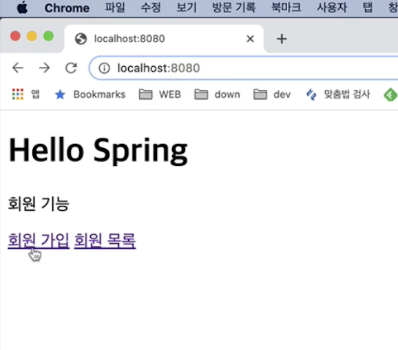
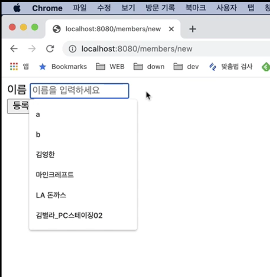
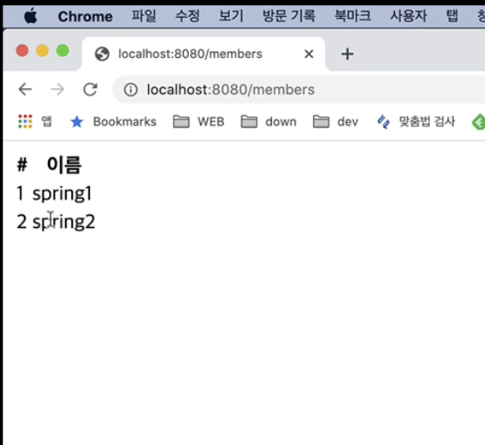
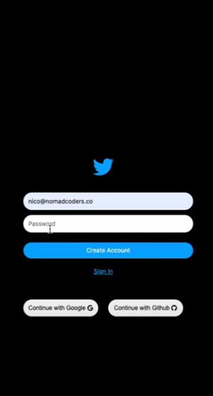

<small>**빠르게 완료할 수 있고, 강의, 블로그 등 이미 소스가 있는 주제를 권장함**</small> 

## 진영

1. 이름: 회원 관리 웹

2. 목적
   1. 간단한 회원 등록 및 조회 앱을 Spring을 이용하여 제작해봄으로서 JPA, Spring, DB 등의 기술을 익힌다.
     
3. 내용
   1. 회원, 등록 및 조회 버튼이 있는 사이트가 있음
   2. 회원 등록을 누르면 회원 등록을 할 수 있는 사이트가 나옴
   3. 회원 조회를 누르면 회원을 조회할 수 있는 사이트가 나옴
   
4. 예시 이미지

   {: width="30%" height="30%"} {: width="30%" height="30%"}{: width="30%" height="30%"}
---

## 애지

1. 이름: 실시간 realtime 채팅 웹(트위터 클론코딩)  
2. 목적
   1.  리액트 hook을 사용해서 만들어지는 웹 프론트 개발 과정을 경험해본다.(firebase로부터 백엔드 기능들을 제공받아 프론트만 구현)  
3. 내용
   1. 이메일, 패스워드를 입력하여 계정 생성
   2. 로그인을 하면 개인 프로필을 확인하고 편집할 수 있음
   3. 로그인을 한 사람들끼리 realtime으로 메세지, 사진 등을 주고 받음  
4. 예시 이미지(디자인은 아래 이미지와 다를 수 있습니다..)

   {: width="30%" height="30%"} {: width="30%" height="30%"}
---

## 창하

1. 이름: Build the Web-Based Board Sites with Basic CRUD
2. 목적
   1. Learn about basic structure of Web-service and follow up the tutorials of it with SpringBoot. We can be used to developing from local-hosted web pages to using AWS hosting service with CI/CD pipeline.
3. 내용
   1. ?
4. 예시

---

## 은기

1. 이름: 졸업여건
2. 목적
   1. 졸업 요건을 출력해보는 방식으로 공익을 실현함과 동시에 장고에 대한 이해도를 높인다 . 기존의 방식은 실행파일이나 고정된 코드로 이뤄져 졸업요건에 오류가 발생할 때 피드백을 즉각 반영하기 어렵지만 웹사이트로 구축해 이후 21학번이나 알고리즘에 오류가 있을 시 쉽게 고칠 수 있다. 또한, 홈페이지를 확장해 졸업요건뿐만 아닌 취업 정보, 시간표 장바구니 등 다양한 기능을 추가해 사용자를 늘릴 수 있다.
3. 내용
   1. 
front-end는 vanilajs css 를 통해 구축 
backend는 django를 이용해 구축 

구현해야할 backend logic 
form을 이용해 POST 방식으로 파일을 서버에 받아온 후 서버에서 알고리즘을 구현해 result페이지에 졸업 요건 현황을 알려주는 홈페이지 구축 

4. 예시 (디자인 및 출력)

